# ㊙ Burak BALTA ඞ Red Team Operator 🥋



## 🚀 HAKKIMDA
Python Junior | Network Intrusions | CTF Hunter | Penetration Testing

--- 
### 🧠 CORE DOMAINS OF INFLUENCE
- 🕷️ **Network Ghosting & Firewall Evasion** – Packet cloaking, tunneling, anti-detection chains  
- 🕵️ **Deep Recon & Footprint Analysis** – Stealth scanning, web & infra mapping, intel automation  
- 🚪 **Privilege Escalation Tactician** – Linux & Windows post-exploitation, lateral movement vectors  
- 🧰 **Payload & Exploit Engineering** – Custom Python/Bash shells, listener modules, hybrid payloads  
- ⚔️ **Full-Spectrum Red Ops** – Recon → Exploit → Persistence → Exfiltration → Cover Tracks  
- 🔥 **DoS/DDoS Orchestration** – Adaptive WAF bypass, spoofed vectors, proxy-chained attacks  
- 🧪 **Exploit Simulation Lab** – SQLi/XSS/LFI/BAC edge-case testing & PoC automation  
- 🐚 **Shellcraft & Listener Network** – Hybrid shells, multi-node command chains, event-driven triggers  
- 🛡️ **Anti-Forensics & Logging Manipulation** – Real-time detection evasion, decoy trails, log scrubbing  

---

### ⚔️ WEAPONIZED TOOLKIT (Pinned Repos) 🔵🤞🏻🔴🤌🏻🫴🏻🟣

| Tool | Mission Profile |
|------|----------------|
| `SmartNetShield` | Adaptive packet inspection firewall with live rule injection & forensic evasion |
| `BlackStormDOS` | Stealth-mode DoS orchestrator with dynamic proxy & WAF fingerprinting |
| `GhostVPN` | Autonomous VPN switcher, kill-switch logic, log wipers, dark mode |
| `SSH BruteForcer GUI` | PyQt5-based password brute-force engine with AI-driven probability analysis |
| `MITM Defender` | ARP/MITM detection and active countermeasure toolkit |
| `AI-Social-OSINT` | Passive OSINT pipeline, social footprint profiling, behavior tracking |
| `Sentinel` | AI-powered offensive security framework with modular exploit delivery & CVSS scoring |

---

### 🕶️ TECH STACK & OPS ENVIRONMENT

**Programming & Scripting:** Python, Bash, PowerShell  
**Network & Security Arsenal:** Nmap, Wireshark, Netcat, VPN, Burp Suite, Metasploit, Proxychains  
**Versioning & Automation:** Git, GitHub Actions, CLI pipelines, cron automation 

<div align="center">


</div>

---

### 📊 OPERATIONAL METRICS
```python
class RedTeamOperator:
    def __init__(self):
        self.skills = {
            'network_operations': 85,
            'exploit_development': 78,
            'privilege_escalation': 82,
            'stealth_evasion': 88,
            'tool_development': 80
        }
        self.status = "ACTIVE"
        self.mode = "STEALTH"
        
operator = RedTeamOperator()
print(f"Operational Status: {operator.status}")
print(f"Current Mode: {operator.mode}")
