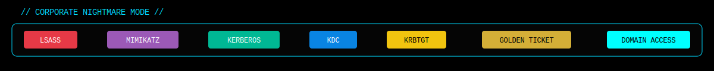

<h1 align="center">
   Offensive Security Researcher
</h1>

# 📚 Deep Dive Cybersecurity Articles & Writeups

Deep technical articles, security research, vulnerability analysis, CTF solutions and experimental studies focused on cybersecurity.

| Article / Research | Description |
|---|---|
| 🚁 [Drone C2 Research](https://github.com/burakcanbalta/Drone-C2-Research) | Research on drone communication architectures, command & control systems and security analysis |
| 📡 [RFID Security Research](https://github.com/burakcanbalta/RFID) | RFID communication protocols, security mechanisms and vulnerability analysis |
| 🌐 [OSI Vulnerability Research](https://github.com/burakcanbalta/osi-vulnerability) | Security analysis and vulnerability research across OSI layers |
| 🏴 [CTF Writeups](https://github.com/burakcanbalta/CTF-Writeup) | CTF solutions, exploitation methodologies and technical walkthroughs |
| 🛰️ [GPS Spoofing Research](https://github.com/burakcanbalta/GPS-Spoofing) | GPS spoofing concepts, signal manipulation techniques and security implications |
| 🚗 [Tesla Key Fob Security Analysis](https://github.com/burakcanbalta/Tesla-key-fob) | Automotive security research focused on keyless entry systems |
| 📱 [IMSI Security Research](https://github.com/burakcanbalta/IMSI) | Mobile network identity analysis and IMSI security concepts |
| 🔐 [KEC Research](https://github.com/burakcanbalta/KEC) | Security protocol analysis and cryptographic research |
| 🔥 [pfSense Network Lab](https://github.com/burakcanbalta/pfsense-network-lab) | Firewall architecture, network segmentation and infrastructure security laboratory |

---

# 🛠️ Security Tools

Custom security tools, automation projects and research-oriented utilities developed for cybersecurity experimentation, testing and learning purposes.

| Tool / Project | Description |
|---|---|
| 👻 [GhostVPN](https://github.com/burakcanbalta/ghostvpn) | VPN automation and secure networking management utility |
| 🌐 [IP MAC Changer](https://github.com/burakcanbalta/ipmachanger) | Network interface management and MAC address changing utility |
| 🍯 [Honeypot](https://github.com/burakcanbalta/honeypot) | Honeypot environment for attack observation and security monitoring research |
| 💉 [SQLiScan Pro](https://github.com/burakcanbalta/SQLiScan-Pro) | SQL injection detection and web security testing framework |
| 🔑 [SSH Bruteforce](https://github.com/burakcanbalta/ssh-bruteforce) | SSH authentication security testing utility |
| 💾 [PhantomDisk](https://github.com/burakcanbalta/PhantomDisk) | Storage and disk security research project |
| 🌑 [ShadowDrop](https://github.com/burakcanbalta/ShadowDrop) | Security automation and research-focused utility |

---

# 🕶️ TECH STACK & OPS ENVIRONMENT

