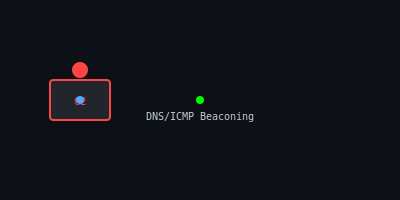
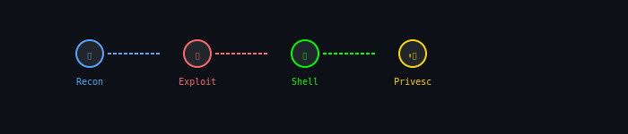
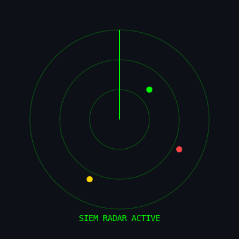
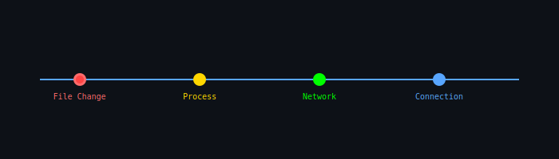

<h1 align="center">🎲🎰♠ Burak BALTA ඞ Red Team Operator ♣🤑♣</h1>

  <code>Offensive Security | Penetration Testing | Vulnerability Research — Focus: exploit development, privilege escalation, secure-by-design recommendations. Academic ties: Uludağ Üniversitesi.</code>

---

  
|  |  |
|:---:|:---:|
| **Live Exploit Development** | **C2 Infrastructure** |

|  |  |
|:---:|:---:|
| **Attack Lifecycle** | **Stealth Operations** |

--- 
### 🧠 CORE DOMAINS OF INFLUENCE
- 🕷️ **Network Ghosting & Firewall Evasion** – Packet cloaking, tunneling, anti-detection chains  
- 🕵️ **Deep Recon & Footprint Analysis** – Stealth scanning, web & infra mapping, intel automation  
- 🚪 **Privilege Escalation Tactician** – Linux & Windows post-exploitation, lateral movement vectors  
- 🧰 **Payload & Exploit Engineering** – Custom Python/Bash shells, listener modules, hybrid payloads  
- ⚔️ **Full-Spectrum Red Ops** – Recon → Exploit → Persistence → Exfiltration → Cover Tracks  
- 🔥 **DoS/DDoS Orchestration** – Adaptive WAF bypass, spoofed vectors, proxy-chained attacks  
- 🧪 **Exploit Simulation Lab** – SQLi/XSS/LFI/BAC edge-case testing & PoC automation  
- 🐚 **Shellcraft & Listener Network** – Hybrid shells, multi-node command chains, event-driven triggers  
- 🛡️ **Anti-Forensics & Logging Manipulation** – Real-time detection evasion, decoy trails, log scrubbing  

---

### 🔵 DEFENSE & DETECTION SYSTEMS
|  |  |
|:---:|:---:|
| **Threat Intelligence** | **Real-time Alerts** |

|  |  |
|:---:|:---:|
| **Active Defense** | **Incident Response** |

---

### ⚔️ WEAPONIZED TOOLKIT (Pinned Repos) 🔵🤞🏻🔴🤌🏻🫴🏻🟣

| Tool | Mission Profile |
|------|----------------|
| [`BlackStormDOS`](https://github.com/burakcanbalta/BlackStormDOS) | Stealth-mode DoS orchestrator with dynamic proxy & WAF fingerprinting |
| [`GhostVPN`](https://github.com/burakcanbalta/GhostVPN) | Autonomous VPN switcher, kill-switch logic, log wipers, dark mode |
| [`MITM Defender`](https://github.com/burakcanbalta/mitmdefender) | ARP/MITM detection and active countermeasure toolkit |
| [`ShellCraft`](https://github.com/burakcanbalta/shell) | Advanced shell development toolkit & reverse shell generator |
| [`SQLiScan Pro`](https://github.com/burakcanbalta/SQLiScan-Pro) | Advanced SQL injection detection & exploitation framework |

---

### 🕶️ TECH STACK & OPS ENVIRONMENT

