<h1 align="center">㊙ Burak BALTA ඞ Red Team Operator 🥋</h1>

<p align="center">
  <b>Python Junior | Network Intrusions | CTF Hunter | Penetration Testing | Privilege Escalation</b><br>
  <code>Building offensive security tools & stealth operation frameworks</code>
</p>

---

<div align="center">

### 🔴 OFFENSIVE CYBERSECURITY
|  |  |
|:---:|:---:|
| **Live Exploit Development** | **C2 Infrastructure** |

|  |  |
|:---:|:---:|
| **Attack Lifecycle** | **Stealth Operations** |

</div>

--- 
### 🧠 CORE DOMAINS OF INFLUENCE
- 🕷️ **Network Ghosting & Firewall Evasion** – Packet cloaking, tunneling, anti-detection chains  
- 🕵️ **Deep Recon & Footprint Analysis** – Stealth scanning, web & infra mapping, intel automation  
- 🚪 **Privilege Escalation Tactician** – Linux & Windows post-exploitation, lateral movement vectors  
- 🧰 **Payload & Exploit Engineering** – Custom Python/Bash shells, listener modules, hybrid payloads  
- ⚔️ **Full-Spectrum Red Ops** – Recon → Exploit → Persistence → Exfiltration → Cover Tracks  
- 🔥 **DoS/DDoS Orchestration** – Adaptive WAF bypass, spoofed vectors, proxy-chained attacks  
- 🧪 **Exploit Simulation Lab** – SQLi/XSS/LFI/BAC edge-case testing & PoC automation  
- 🐚 **Shellcraft & Listener Network** – Hybrid shells, multi-node command chains, event-driven triggers  
- 🛡️ **Anti-Forensics & Logging Manipulation** – Real-time detection evasion, decoy trails, log scrubbing  

---

<div align="center">

### 🔵 DEFENSE & DETECTION SYSTEMS
|  |  |
|:---:|:---:|
| **Threat Intelligence** | **Real-time Alerts** |

|  |  |
|:---:|:---:|
| **Active Defense** | **Incident Response** |

</div>

---

### ⚔️ WEAPONIZED TOOLKIT (Pinned Repos) 🔵🤞🏻🔴🤌🏻🫴🏻🟣

| Tool | Mission Profile |
|------|----------------|
| [`SmartNetShield`](https://github.com/burakcanbalta/SmartNetShield) | Adaptive packet inspection firewall with live rule injection & forensic evasion |
| [`BlackStormDOS`](https://github.com/burakcanbalta/BlackStormDOS) | Stealth-mode DoS orchestrator with dynamic proxy & WAF fingerprinting |
| [`GhostVPN`](https://github.com/burakcanbalta/GhostVPN) | Autonomous VPN switcher, kill-switch logic, log wipers, dark mode |
| [`MITM Defender`](https://github.com/burakcanbalta/mitmdefender) | ARP/MITM detection and active countermeasure toolkit |
| [`Sentinel`](https://github.com/burakcanbalta/Sentinel) | AI-powered offensive security framework with modular exploit delivery & CVSS scoring |
| [`ShellCraft`](https://github.com/burakcanbalta/shell) | Advanced shell development toolkit & reverse shell generator |
| [`InfoSec Toolkit`](https://github.com/burakcanbalta/infosec) | Comprehensive information security utilities & penetration testing tools |
| [`SQLiScan Pro`](https://github.com/burakcanbalta/SQLiScan-Pro) | Advanced SQL injection detection & exploitation framework |

---

## 📚 RESEARCH & WHITEPAPERS

<div align="center">

### 🔬 ADVANCED CYBERSECURITY RESEARCH

</div>

#### **🛰️ Wireless & Hardware Security**
- [**RFID Security Research**](https://github.com/burakcanbalta/RFID) - RFID cloning, sniffing, and security analysis
- [**Drone C2 Research**](https://github.com/burakcanbalta/Drone-C2-Research) - Drone command & control security assessment
- [**GPS Spoofing Research**](https://github.com/burakcanbalta/GPS-Spoofing) - GPS signal manipulation & defense mechanisms
- [**Tesla Key Fob Security**](https://github.com/burakcanbalta/Tesla-key-fob) - Automotive security research on Tesla key systems
- [**IMSI Catcher Detection**](https://github.com/burakcanbalta/IMSI) - Cellular network security & IMSI catcher identification
- [**KEC Research**](https://github.com/burakcanbalta/KEC) - Advanced cryptographic & encryption research

#### **🎯 Ongoing Research Areas**
- **5G Network Security** - Next-generation cellular security assessment
- **IoT Device Exploitation** - Smart device security research
- **Automotive Cybersecurity** - Vehicle network penetration testing
- **Critical Infrastructure** - SCADA/ICS security research

---

## 🎖️ SECURITY BADGES & RECOGNITION

<div align="center">


**Red & Blue Team Expertise - Full Spectrum Cybersecurity**


</div>

---

### 🕶️ TECH STACK & OPS ENVIRONMENT

<div align="center">


</div>

---

## 📊 OPERATIONAL METRICS

```go
package main

import "fmt"

type CyberSecurityOperator struct {
    Name          string
    Codename      string
    Status        string
    Clearance     string
    Specializations map[string]int
    SuccessRate   float64
}

func main() {
    operator := CyberSecurityOperator{
        Name:      "Burak BALTA", 
        Codename:  "SPECTRE",
        Status:    "ACTIVE",
        Clearance: "TOP_SECRET",
        SuccessRate: 94.7,
        Specializations: map[string]int{
            "Red Team Operations":   88,
            "Malware Analysis":      85,
            "Reverse Engineering":   82,
            "Exploit Development":   84,
            "Network Security":      87,
            "Incident Response":     78,
            "Digital Forensics":     80,
        },
    }

    fmt.Printf("Operational Status: %s\n", operator.Status)
    fmt.Printf("Engagement Mode: %s\n", operator.Clearance)
    fmt.Printf("Mission Success Rate: %.1f%%\n", operator.SuccessRate)
}
```
